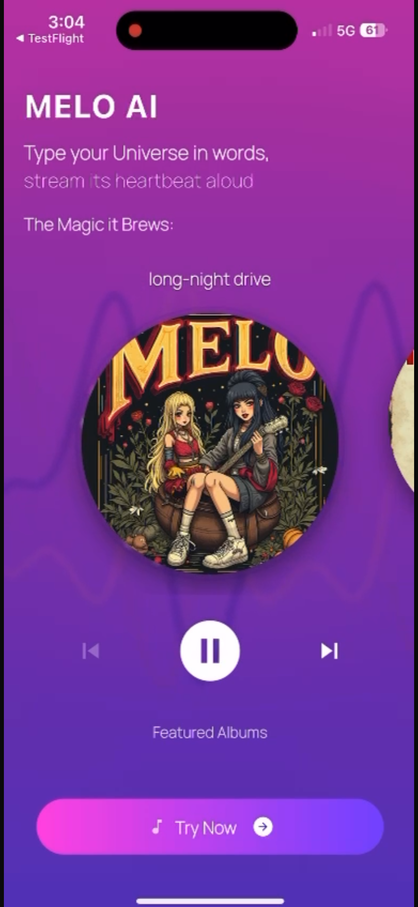
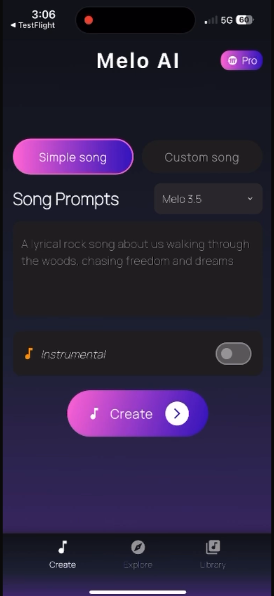
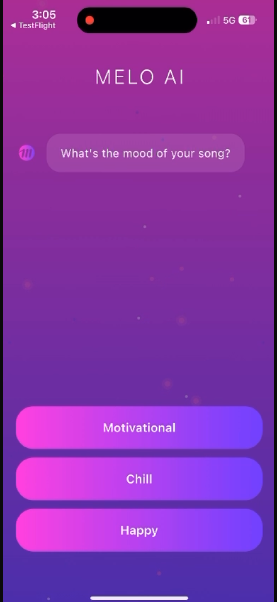
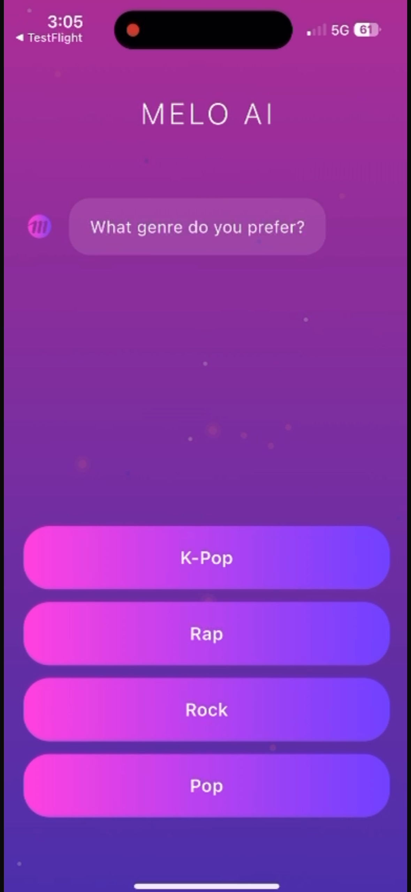
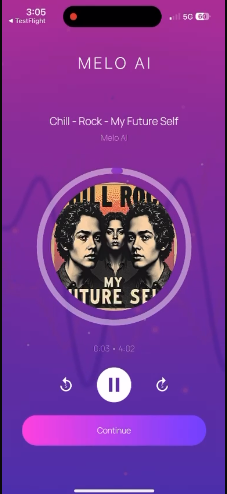
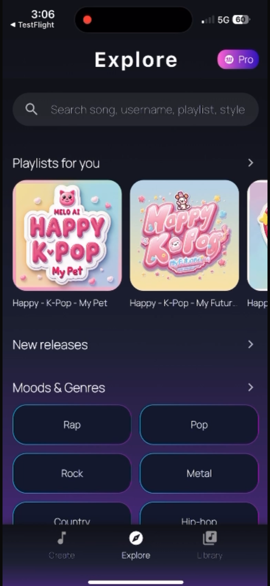

# Melo AI - MUSIC GENERATION APP

Melo AI is an AI-powered music generation application that enables users to create personalized songs through a guided, conversational workflow. Users define mood, genre, and theme, and the platform generates complete music tracks using advanced AI models. The app is designed for scalability, performance, and long-term maintainability using a clean MVVM architecture and a cloud-native backend.

---

## Overview

Melo AI provides an end-to-end music creation experience, from onboarding to song generation, playback, discovery, and subscription-based premium features. The product is built with a strong separation of concerns, ensuring predictable state management, testability, and rapid feature iteration.

---

## Core Features

### Guided Song Creation
<p align="center">
  
</p>

Users are taken through a structured onboarding flow that captures creative intent:
- Mood selection (e.g. Happy, Chill, Motivational)
- Genre selection (e.g. Pop, Rock, Rap, K-Pop)
- Song theme selection (e.g. Love, Future Self, Pet)

These inputs are compiled into a structured prompt for AI music generation.

### AI Music Generation
- AI-generated vocals and instrumentals
- Instrumental-only generation support
- Multiple generation models (e.g. Melo 3.5)
- High-quality audio output (MP3 and WAV)

### Playback and Preview
- In-app audio player with waveform visualization
- Seek, replay, and skip controls
- Instant preview after generation

### Premium Features
- Unlimited song generation
- Voice cloning for personalized vocals
- Priority processing and faster generation
- High-quality audio downloads
- Advanced customization options

### Explore and Discovery
- Curated playlists by mood and genre
- Search by song, playlist, or style
- New releases and featured AI-generated albums
- Personal library for saved creations

---

## Application Flow
<p align="center">
  
</p>
1. Welcome and onboarding
<p align="center">
  
</p>

2. Mood selection
<p align="center">
  
</p>
3. Genre selection
<p align="center">
  
</p>
4. Song theme selection
<p align="center">
  
</p>
5. AI song generation
<p align="center">
  
</p>
6. Subscription upgrade (optional)
<p align="center">
  
</p>
7. Explore and library access

This flow minimizes friction for new users while progressively introducing advanced functionality.

---

## Architecture

Melo AI follows a strict Model–View–ViewModel (MVVM) architecture to ensure a clean separation of concerns between UI, business logic, and data layers.

### Architecture Principles
- UI remains declarative and stateless
- ViewModels handle business logic and state
- Models represent domain and data structures
- External services are abstracted behind repositories

---

## MVVM Architecture Diagram

```text
┌──────────────────────────┐
│          View            │
│  UI Screens and Widgets  │
│                          │
│  - Onboarding            │
│  - Song Creation         │
│  - Player                │
│  - Explore / Library     │
└────────────▲─────────────┘
             │ UI State
┌────────────┴─────────────┐
│        ViewModel          │
│                          │
│  - Business Logic        │
│  - User Intent Handling  │
│  - State Management      │
│  - Validation            │
└────────────▲─────────────┘
             │ Domain Models
┌────────────┴─────────────┐
│          Model           │
│                          │
│  - Song Metadata         │
│  - Audio References      │
│  - User Preferences     │
│  - Subscription State   │
└────────────▲─────────────┘
             │
┌────────────┴─────────────┐
│     Data and Services    │
│                          │
│  - Supabase Backend      │
│  - AI Generation APIs    │
│  - Storage and Auth      │
│  - Payments              │
└──────────────────────────┘
